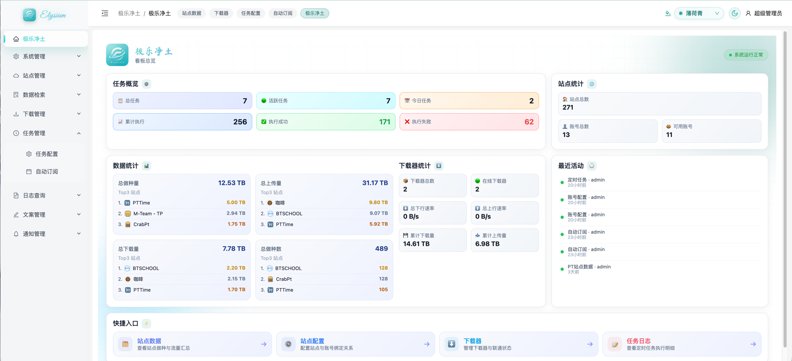
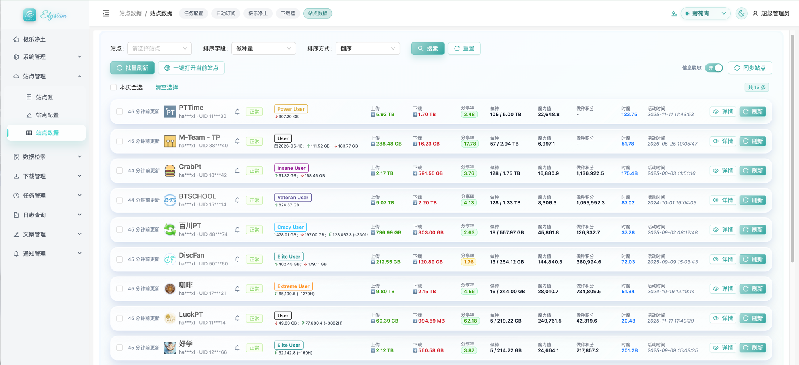
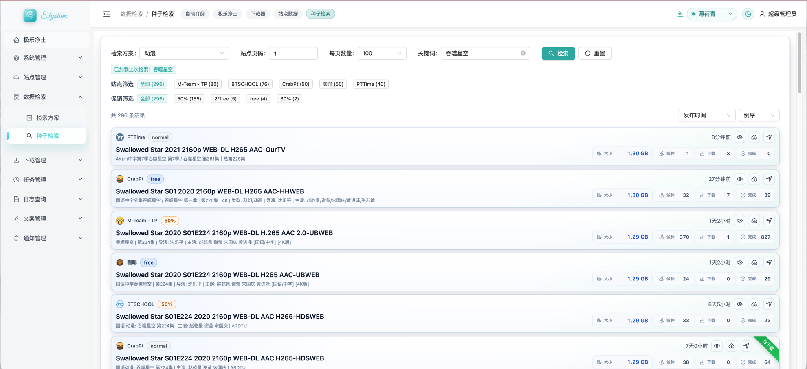
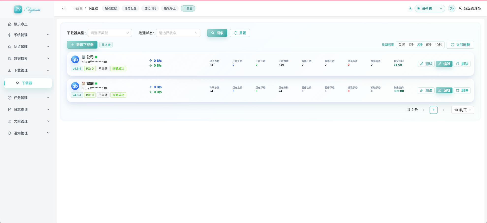
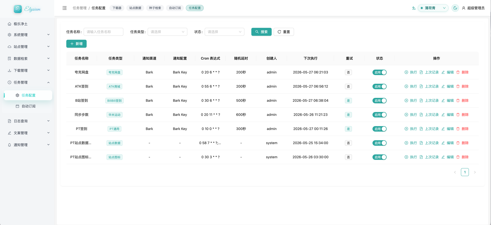
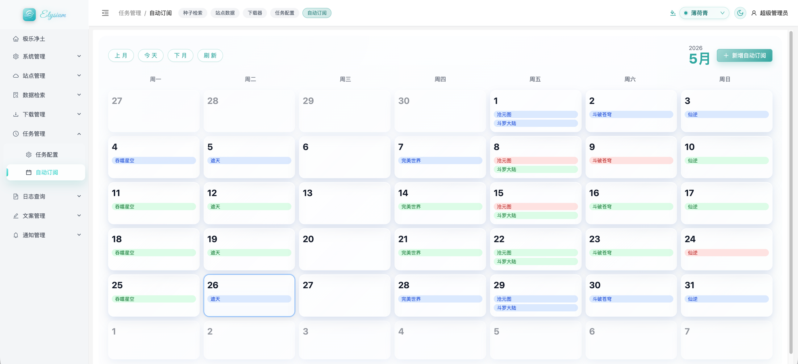

##  Elysium - 极乐净土

```text
项目完全为技术学习交流使用，🈲禁止在任何国内平台宣传发布相关内容
```


### 👋🏻 前言
- ❓这是什么：是一个集自动任务、PT订阅、通知推送于一体的一个小众平台。
- ❓为什么做：
  - 因为免费了一个月的`codex`让我开了个头，结果没干完又花了20💲续费接着干。
  - 😝开玩笑啦，因为不满足于手机端看站点信息还有下载种子，手机端没有PT-Depiler，挨着打开站点又很难。所以就下手了。
  - 其实MP已经可以实现足够的需求，但是，但是，但是⬆️`codex`首月免费。  

<br/>
🚫 该项目不会面向所有人所有需求，只是一些小众非专业的玩家。  

🚫 PT站点适配有限，因为我没有 💊 啊，也没有太多精力适配。  

🚫 任务模块好多需要抓token，不会玩的可以不去用。  

🫰🏻 我还是希望大家去拥抱更成熟插件也更丰富的 `MoviePilot`，我起初做这个只是为了自己玩的。

### 🧩 系统功能图

下列截图展示了系统的主要工作流：看板总览、站点数据、种子检索、下载器、任务配置和自动订阅。

| 看板总览 | 站点数据 |
| --- | --- |
|  |  |

| 种子检索 | 下载器 |
| --- | --- |
|  |  |

| 任务配置 | 自动订阅 |
| --- | --- |
|  |  |

### 📒 文档目录

- [PT 模块功能](docs/pt-module.md)：站点源、站点配置、站点数据、数据检索与种子检索。
- [任务模块功能](docs/task-module.md)：任务配置、执行、重试、日志与通知。
- [下载器模块](docs/downloader-module.md)：下载器配置、连通测试、实时状态与种子推送。
- [自动订阅模块](docs/auto-subscribe.md)：订阅日历、检索方案、筛选、下载器与通知联动。
- [支持站点列表](docs/supported-sites.md)：初始化站点数据整理。


### 🔎 支持范围

---

#### 🗓️ 任务类型
| 名称 | 说明             | 条件                    |
| --- |----------------|-----------------------|
| `华米运动` | 原小米运动刷步数 | 用户ID/accessToken      |
| `BiliBili签到` | B站签到任务 | Cookie                |
| `ATK商城` | ATK 商城签到任务 | token/refreshToken    |
| `夸克网盘` | 夸克网盘签到 | Cookie(需包含：kps，sign，vcode) |
| `PT通用` | PT签到/数据获取/种子订阅 | 账号/Cookie（MT需要token）  |

---

#### 🪧 支持站点
```text
⚖️ 排名不分先后
```

| ✅ M-Team  | ✅ PTTime | ✅ CrabPt | ✅ BTSCHOOL |
|-----------|----------|----------|------------|
| ✅ DiscFan | ✅ 咖啡     | ✅ LuckPT | ✅ 好学       |
| ✅ 躺平      | ✅ PTSkit | ✅ PT分享站  | ☑️ Afun    |
| ...       | ...      | ...      | ...        |

---

#### 📳 推送方式

| ✅ Bark      | ☑️ 企业微信 | ☑️ 钉钉 | ☑️ 邮件 |
|-------------|---------|-------|-------|
| ☑️ Telegram | ...     | ...   | ...   |

---

#### ⏬ 下载器

| 下载器           | 说明  |
|---------------|-----|
| ✅ qBittorrent | 登录、连通测试、实时状态、推送种子 |
| ☑️ Transmission | 连通测试、推送种子 |
| ☑️ Aria2 | 连通测试、推送种子 |

---

## Docker 部署

### 部署文件

建议在部署机准备如下文件：

```text
docker-compose.yml
.env.prod
```

`docker-compose.yml` 示例：

```yaml
version: "3.2"

services:
  elysium:
    image: hanxlabs/elysium-docker:latest
    container_name: elysium
    # 环境变量文件
    env_file:
      - .env.prod
    ports:
      # 宿主机端口:容器端口（前端/Nginx 入口）
      - "${WEB_PUBLISH_PORT:-80}:80"
      # 宿主机端口:容器端口（后端 API 对外映射，如果需要文案的查询可以考虑映射这个）
      # - "${API_PUBLISH_PORT:-8088}:8088"
    restart: always
    volumes:
      # 挂载数据目录到容器内，保存数据库/日志/图标等持久化数据
      - "${DATA_ROOT:-/data/elysium}:/data/elysium"
```

`.env.prod` 常用配置：

```env
# 时区设置，建议与服务器所在时区一致
TZ=Asia/Shanghai

# 宿主机数据根目录（务必改成你的实际路径）
DATA_ROOT=/data/elysium/data

# 对外发布端口
WEB_PUBLISH_PORT=80
API_PUBLISH_PORT=8088

# 后端服务监听端口与上下文路径
SERVER_PORT=8088
SERVER_CONTEXT_PATH=/api
# 前端/Nginx 反向代理到后端的地址（容器内通常用 127.0.0.1:8088）
API_UPSTREAM=http://127.0.0.1:8088

# MySQL 配置（生产环境务必改强密码）
MYSQL_PORT=3306
MYSQL_ROOT_PASSWORD=please-change-me
MYSQL_DATABASE=elysium
MYSQL_USERNAME=root
MYSQL_PASSWORD=please-change-me

# Redis 配置（若无密码可留空）
REDIS_HOST=127.0.0.1
REDIS_PORT=6379
REDIS_PASSWORD=
REDIS_DATABASE=0

# JWT 密钥（务必改成长随机串）
JWT_SECRET=please-change-to-a-long-random-secret
# 图标缓存目录（容器内路径，通常不改）
ICON_DIR=/data/elysium/icon
# 日志文件路径（容器内路径）
LOG_FILE=/data/elysium/logs/elysium.log
# 是否强制初始化数据库（首次部署可 true，后续建议 false）
FORCE_INIT_DB=false
```

#### ▶️ 启动

```bash
docker compose up -d
```

启动后访问 `http://部署机器地址:${WEB_PUBLISH_PORT}`。


#### ⚠️ ❕❕❕安全建议

- 部署前务必修改 `MYSQL_ROOT_PASSWORD`、`MYSQL_PASSWORD` 和 `JWT_SECRET`。
- 若公网访问，建议放在反向代理或网关后并启用 HTTPS。
- PT 站点 Cookie、下载器密码和 Bark Key 都属于敏感配置，避免把 `.env.prod` 或数据库备份公开。